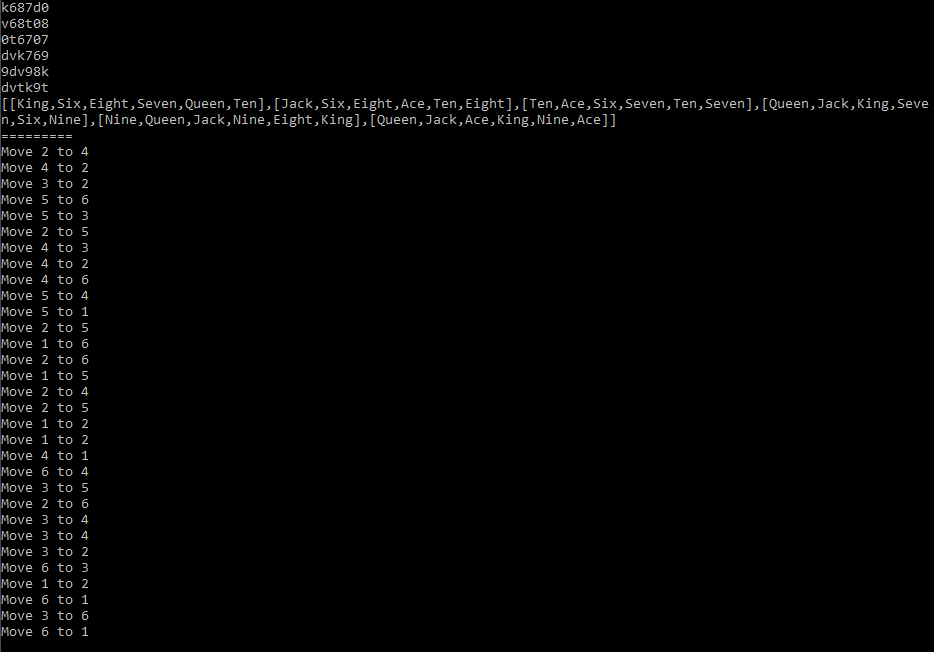

# MOLEK-SYNTEK Solitaire solver

This is a primitive but (mostly) fast and working solitaire solver.



## How to compile/use

1. `git clone https://github.com/plneappl/molek-syntez-solver`
2. `cd molek-syntek-solver`
3. `stack run`
4. Input your solitaire board in columns, starting on the left, note that 10 is input as `0`, for example:
```sh
k088q6 # first column is king, 10, 8, 8, queen, 6
8t6907
q8tv6k
09qtkv
q7990v
vt776k
```
5. Hope it finds a solution in an acceptable time.
